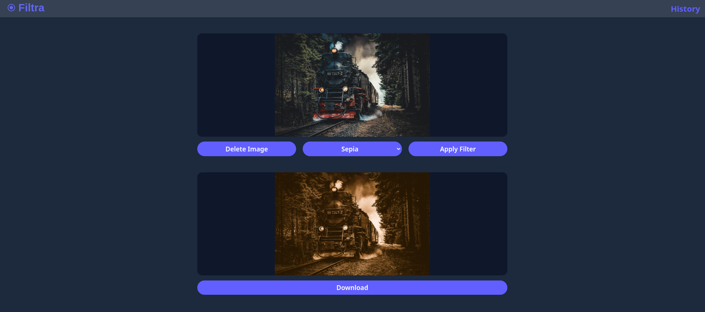

# filtra


A full-stack web application built with Vue.js and Express that allows users to upload and apply filters to images — including background removal using ApyHub.

## Features
- Upload images from your device
- Apply filters: grayscale, sepia, black & white
- Use AI for background removal (ApyHub) via backend API requests
- View image history
- Instant previews

## Installation & Setup

### 1. Prerequisites
In order to use the remove background functionality you will need an API key from [apyhub](https://apyhub.com/utility/image-processor-remove-background). While the app will run without it, an API key is required for full functionality, including background removal.
You will also need to have `nodejs` installed on your machine. Run one of the following commands to install `nodejs` onto your machine if you need to install it.

### 2. Install Node.js
#### **MacOS & Linux Users**
```bash
curl -sS https://webi.sh/node | sh; \
source ~/.config/envman/PATH.env
```

#### **Windows Users**
```powershell
curl.exe https://webi.ms/node | powershell
```
> [!IMPORTANT]
> If using windows you have to run install commands inside a bash emulator. I would recommend **Git Bash** or **WSL**
> ```powershell
> curl.exe https://webi.ms/git | powershell
> ```

### 3. Install repository and setup your environment

Now that you have nodejs on your machine you can copy and paste the following code in a directory you want to download, install, and run this repository:
```bash
git clone https://github.com/rgibby818/Filtra.git
cd Filtra/
chmod +x ./scripts/setup.sh ./scripts/cleanup.sh
./scripts/setup.sh
```
> [!IMPORTANT]
> During setup, you will be prompted to enter your ApyHub API key. You can skip it, but functionality will be limited. If you select no, and want to add it later, copy and paste this code below replacing YOUR_API_KEY with your api key.
> `echo "API_KEY=YOUR_API_KEY" > .env`

Now you can navigate to [HERE](http://127.0.0.1:3000/) to start using this application.

> [!TIP]  
> To stop the server in your terminal press Ctrl + c  
> All images will be located in a `uploads/` and `uploads-filtered/` to quickly erase all of them you can run the command `./cleanup.sh`.

## Technologies
- [**Front-end**](https://vuejs.org/): built with Vue 3 and Vite.
- [**Backend**](https://expressjs.com/): uses Express.js and Multer for handling image uploads and processing.
- [**Styling**](https://tailwindcss.com/): Tailwind CSS for all styling.
- [**Image Processing**](https://sharp.pixelplumbing.com/): Sharp for basic filters and ApyHub for background removal.

## Project Structure
```
Filtra/
├── client/           # Vue frontend
├── server/           # Express backend
├── uploads/          # Raw images
├── uploads-filtered/ # Processed images
├── scripts/          # Dev setup and cleanup
├── package.json
├── vite.config.js
```